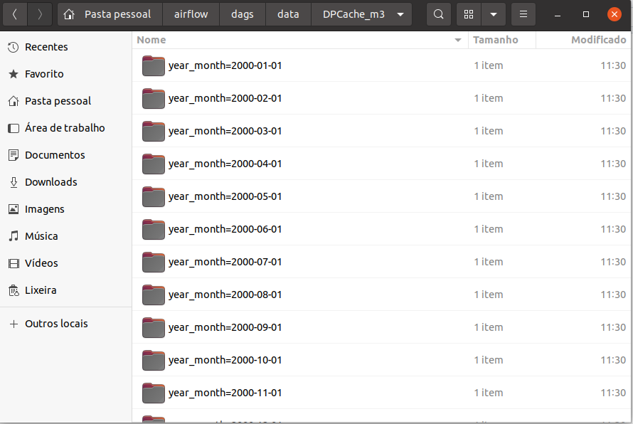

Data Engineering Test Result
====================

This is the result 

## About Solution 
1- created a airflow using docker_compose.

2- create a directory on host at the directory dags/

  cd dags/
  
  mkdir data
  
copy vendas-combustiveis-m3.xls to data

3- drop dag python code to dags 

4- See results at dirs created at the data dir.
## Dag 

## About Result see source and result directories at dags/data

## About Result check partitions

